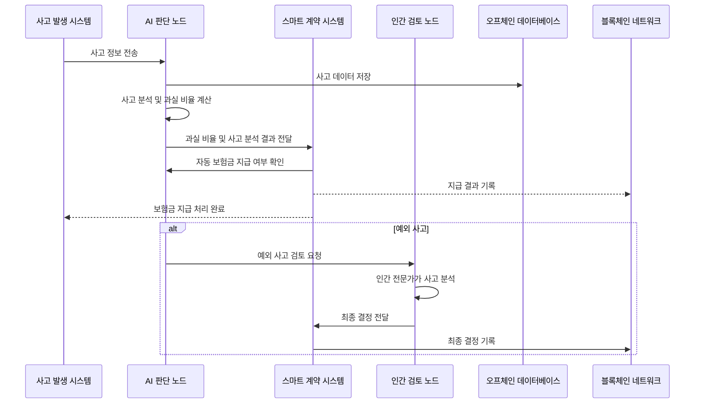

### **1. 시스템 동작 흐름**

---

### **2. 동작 흐름 설명**

#### **1. 사고 발생**

* **사고 발생 시스템**에서 사고 정보가 **AI 판단 노드**로 전송됩니다.
* 사고 정보에는 사고 유형, 시간, 위치 등 사고에 관한 모든 데이터가 포함됩니다.
* **오프체인 데이터베이스**에 사고 데이터를 저장하고, 사고 분석을 위해 AI 모델에 전달됩니다.

#### **2. AI 판단 노드**

* AI가 사고 데이터를 수신한 후, 사고 유형과 관련된 데이터를 분석하여 **과실 비율**을 계산합니다.
* 계산된 과실 비율 및 사고 분석 결과는 **스마트 계약 시스템**에 전달됩니다.

#### **3. 스마트 계약 시스템**

* **스마트 계약 시스템**은 AI로부터 전달받은 과실 비율을 바탕으로 **보험금 지급 여부**를 자동으로 결정합니다.
* 자동으로 결정된 결과는 **블록체인 네트워크**에 기록되어 불변성을 보장합니다.

#### **4. 예외 사고 처리**

* 만약 **AI 판단 노드**가 새로운 유형의 사고나 예외적인 사고를 처리할 수 없다면, **인간 검토 노드**로 **검토 요청**을 보냅니다.
* **인간 전문가**는 사고를 분석한 후 최종 결정을 내리며, 해당 결정은 **스마트 계약 시스템**에 전달되어, **블록체인에 기록**됩니다.

#### **5. 블록체인 기록**

* **블록체인 네트워크**는 사고와 관련된 모든 데이터를 기록합니다. 이 기록은 **불변성**을 보장하고, 모든 참여자가 **투명하게 검증**할 수 있도록 합니다.

---

### **3. 전체 시스템 동작 요약**

1. **사고 발생**: 사고 발생 정보를 수집하여 **AI 판단 노드**에 전달합니다.
2. **AI 분석**: AI는 사고 정보를 분석하여 과실 비율을 계산합니다.
3. **자동화된 보험금 지급**: AI의 분석 결과를 바탕으로 **스마트 계약 시스템**에서 자동으로 보험금 지급 여부를 결정합니다.
4. **예외 처리**: AI가 처리할 수 없는 경우, **인간 검토 노드**가 개입하여 결정을 내립니다.
5. **블록체인 기록**: 모든 데이터는 **블록체인 네트워크**에 기록되어, 완전하고 변조되지 않는 기록을 보장합니다.

---

### **4. 기술적 흐름을 위한 동작 규칙**

1. **AI와 블록체인 상호작용**: AI는 **스마트 계약 시스템**과 연결되어, 보험금 지급 결정 여부를 자동으로 처리합니다.
2. **데이터 저장**: 사고 관련 데이터는 **오프체인 데이터베이스**에 저장되며, 민감한 정보는 **IPFS** 같은 분산 파일 시스템을 사용하여 처리합니다.
3. **AI와 인간 협력**: AI는 예외적인 사고나 새로운 유형의 사고에 대해 **인간 검토 노드**로 처리를 위임할 수 있습니다.
4. **스마트 계약 실행**: 모든 사고 및 결정 사항은 **스마트 계약**을 통해 자동으로 실행되고, 최종 결과는 **블록체인 네트워크**에 기록됩니다.

