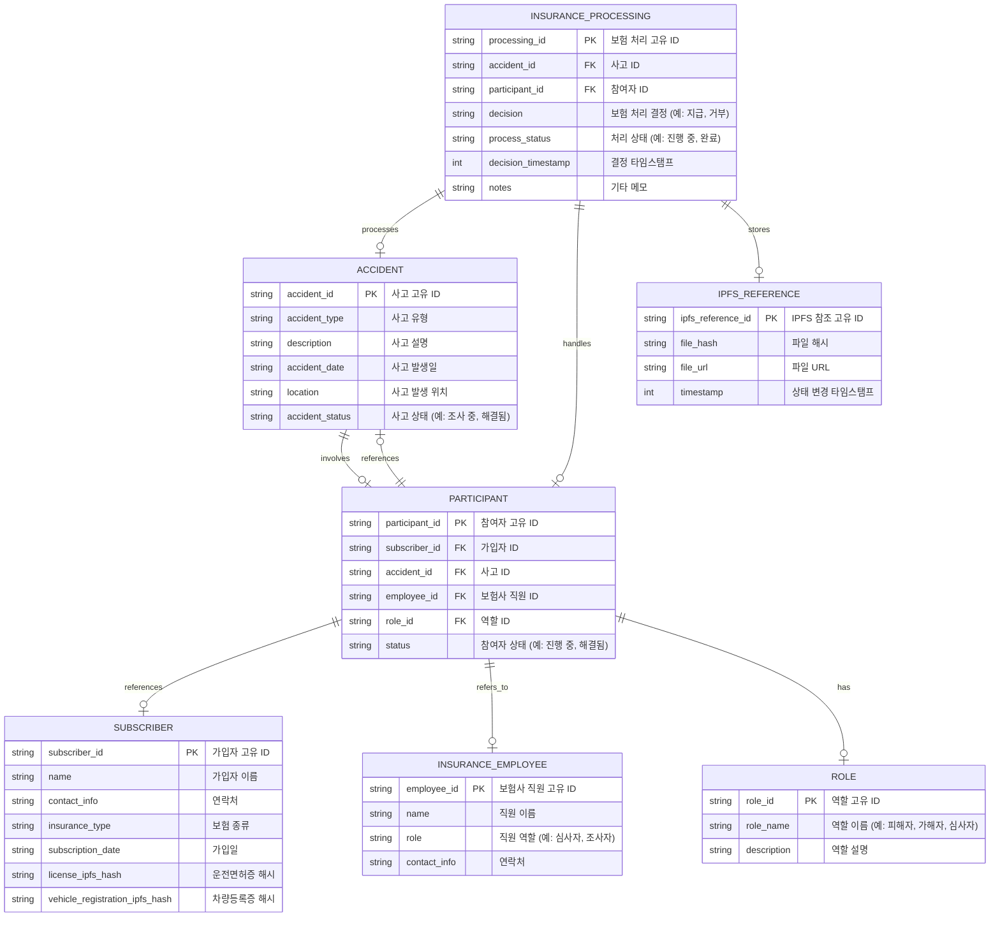

```mermaid
erDiagram
    ACCIDENT {
        string accident_id PK "사고 고유 ID"
        string accident_type "사고 유형"
        string description "사고 설명"
        string accident_date "사고 발생일"
        string location "사고 발생 위치"
        string accident_status "사고 상태 (예: 조사 중, 해결됨)"
    }
    
    SUBSCRIBER {
        string subscriber_id PK "가입자 고유 ID"
        string name "가입자 이름"
        string contact_info "연락처"
        string insurance_type "보험 종류"
        string subscription_date "가입일"
        string license_ipfs_hash "운전면허증 해시"
        string vehicle_registration_ipfs_hash "차량등록증 해시"
    }

    INSURANCE_EMPLOYEE {
        string employee_id PK "보험사 직원 고유 ID"
        string name "직원 이름"
        string role "직원 역할 (예: 심사자, 조사자)"
        string contact_info "연락처"
    }

    INSURANCE_PROCESSING {
        string processing_id PK "보험 처리 고유 ID"
        string accident_id FK "사고 ID"
        string participant_id FK "참여자 ID"
        string decision "보험 처리 결정 (예: 지급, 거부)"
        string process_status "처리 상태 (예: 진행 중, 완료)"
        int decision_timestamp "결정 타임스탬프"
        string notes "기타 메모"
    }

    PARTICIPANT {
        string participant_id PK "참여자 고유 ID"
        string subscriber_id FK "가입자 ID"
        string accident_id FK "사고 ID"
        string employee_id FK "보험사 직원 ID"
        string role_id FK "역할 ID"
        string status "참여자 상태 (예: 진행 중, 해결됨)"
    }

    ROLE {
        string role_id PK "역할 고유 ID"
        string role_name "역할 이름 (예: 피해자, 가해자, 심사자)"
        string description "역할 설명"
    }


    IPFS_REFERENCE {
        string ipfs_reference_id PK "IPFS 참조 고유 ID"
        string file_hash "파일 해시"
        string file_url "파일 URL"
        int timestamp "상태 변경 타임스탬프"
    }

    ACCIDENT ||--o| PARTICIPANT : involves
    PARTICIPANT ||--o| SUBSCRIBER : references
    PARTICIPANT ||--o| ACCIDENT : references
    PARTICIPANT ||--o| INSURANCE_EMPLOYEE : refers_to
    PARTICIPANT ||--o| ROLE : has
    INSURANCE_PROCESSING ||--o| ACCIDENT : processes
    INSURANCE_PROCESSING ||--o| PARTICIPANT : handles
    INSURANCE_PROCESSING ||--o| IPFS_REFERENCE : stores

```