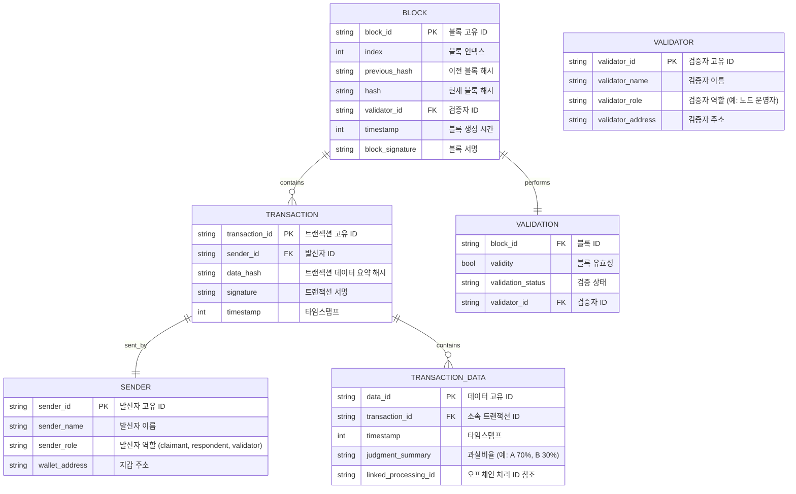

```mermaid
erDiagram
    BLOCK ||--o{ TRANSACTION : contains
    BLOCK ||--|| VALIDATION : performs
    TRANSACTION ||--|| SENDER : sent_by
    TRANSACTION ||--o{ TRANSACTION_DATA : contains

    TRANSACTION {
        string transaction_id PK "트랜잭션 고유 ID"
        string sender_id FK "발신자 ID"
        string data_hash "트랜잭션 데이터 요약 해시"
        string signature "트랜잭션 서명"
        int timestamp "타임스탬프"
    }

    SENDER {
        string sender_id PK "발신자 고유 ID"
        string sender_name "발신자 이름"
        string sender_role "발신자 역할 (claimant, respondent, validator)"
        string wallet_address "지갑 주소"
    }

    TRANSACTION_DATA {
        string data_id PK "데이터 고유 ID"
        string transaction_id FK "소속 트랜잭션 ID"
        int timestamp "타임스탬프"
        string judgment_summary "과실비율 (예: A 70%, B 30%)"
        string linked_processing_id "오프체인 처리 ID 참조"
    }

    BLOCK {
        string block_id PK "블록 고유 ID"
        int index "블록 인덱스"
        string previous_hash "이전 블록 해시"
        string hash "현재 블록 해시"
        string validator_id FK "검증자 ID"
        int timestamp "블록 생성 시간"
        string block_signature "블록 서명"
    }

    VALIDATION {
        string block_id FK "블록 ID"
        bool validity "블록 유효성"
        string validation_status "검증 상태"
        string validator_id FK "검증자 ID"
    }

    VALIDATOR {
        string validator_id PK "검증자 고유 ID"
        string validator_name "검증자 이름"
        string validator_role "검증자 역할 (예: 노드 운영자)"
        string validator_address "검증자 주소"
    }

```
