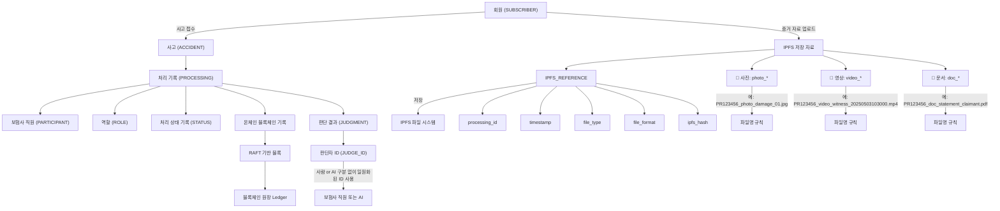

```mermaid
graph TD
  A["회원 (SUBSCRIBER)"] -->|사고 접수| B["사고 (ACCIDENT)"]
  A -->|증거 자료 업로드| C["IPFS 저장 자료"]

  B --> D["처리 기록 (PROCESSING)"]
  D --> E["보험사 직원 (PARTICIPANT)"]
  D --> F["역할 (ROLE)"]
  D --> G["처리 상태 기록 (STATUS)"]

  C --> H["IPFS_REFERENCE"]
  H -->|저장| IPFS["IPFS 파일 시스템"]

  D --> I["온체인 블록체인 기록"]
  I --> J["RAFT 기반 블록"]
  J --> K["블록체인 원장 Ledger"]

  D --> L["판단 결과 (JUDGMENT)"]
  L --> M["판단자 ID (JUDGE_ID)"]
  M -->|사람 or AI 구분 없이 일원화된 ID 사용| N["보험사 직원 또는 AI"]

  C --> C1["📸 사진: photo_*"]
  C --> C2["🎥 영상: video_*"]
  C --> C3["📄 문서: doc_*"]

  C1 -->|예: PR123456_photo_damage_01.jpg| X1["파일명 규칙"]
  C2 -->|예: PR123456_video_witness_20250503103000.mp4| X2["파일명 규칙"]
  C3 -->|예: PR123456_doc_statement_claimant.pdf| X3["파일명 규칙"]

  H --> Y1["processing_id"]
  H --> Y2["timestamp"]
  H --> Y3["file_type"]
  H --> Y4["file_format"]
  H --> Y5["ipfs_hash"]

```